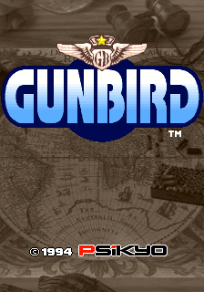

## Presentation

This project is a tribute to the game Gunbird, released by Psikyo in 1994. The team is composed by four students of CITM Terrassa (Catalonia, Spain).

## Description

Gunbird is a shoot'em up game released in Japanese arcades in 1994 by Psikyo. Later, it was included in the videogame consoles Sega Saturn, Play Station and the PC platform Steam. It was included in the Gunbird Special Edition which collects first and second Gunbird editions. Out of Japan, the game was re-named to Mobile Light Force.

The game consists of getting the four parts of a magic mirror that gives a single desire to whom obtains it. The game is divided in seven vertical scrolling stages. Four of them are focused on collecting mirror parts and the last three on arriving to the temple. It has two levels of diffculty. This way, when you finish the story, it restarts to the first stage with a higher level of difficulty.

If you want more information about the game, check the following link: https://github.com/lFreecss/Gunbird/wiki

## Gameplay

(video)

## Installation

Unzip the release folder and execute the .exe file

## Ratkid is composed by:

# Adrià Grionès - Programmer
# Victor Tirado - QA
# David Varela - Artist
# David Valdivia - Management

##Download

(zip folder)

